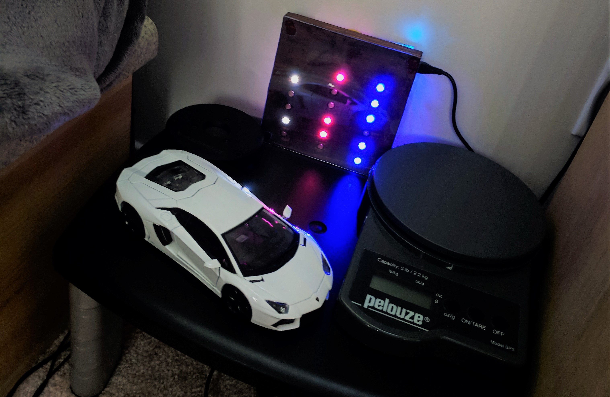
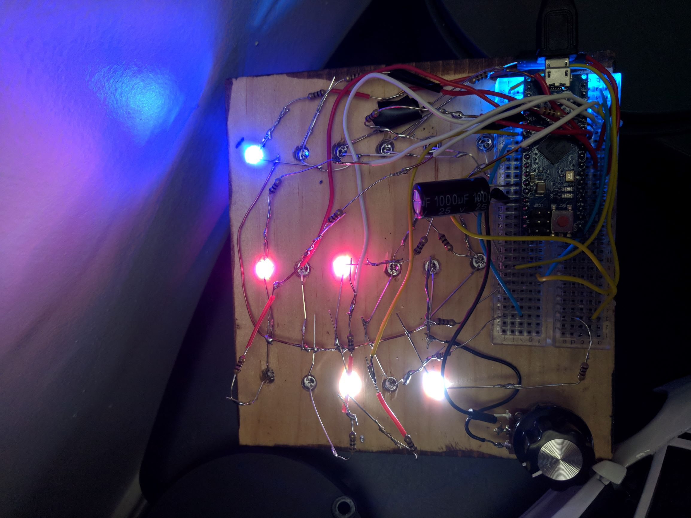

# Binary Clock
This is a rewritten version of the Arduino Binary clock, but with 24HR time and brightness adjustment or just turn off the LEDs but keep the clock running so you won't have to set it again! Inspired to create this because I stained a plank of wood as test piece and it seemed like the perfect size for a binary clock. Contact me if you have issues!

### Materials:
- x1 Arduino based Mircocontroller
- x1 Decoupling Capacitor (220uF-1000uF)
- x17 100-1k ohm resistors (different colors will have different voltage drops)
- x17 LEDs
- x1 10K Potentiometer
- x1 Breadboard/ PCB
- Some wood, wood stain
- Some acrylic
- Some wires (24 gauge)
- Drill and 13/64" bit
  
### Process
Cut a properly sized piece of wood for your LED array. Stain if desired. Cut a similarly sized arcylic piece for the front face (optional). Drill the holes necessary with a 13/64" bit as the LEDs should be 6mm (standard). Reading the clock from left to right, should be hours, minutes, then seconds. We have 24 values to represent for hours so we need 5 bits (32 values). For both seconds and minutes we need 60 values so we need 6 bits (64 values). Therefore there should be a column of x5 6mm holes, followed by a column of x6 6mm holes, and a final column of x6 6mm holes from left to right.

Pins for seconds LEDs are connected to D2, D3, D4, D5, D6, D7 in the bottom to top order. 

Pins for minutes LEDs are connected to D8, D9, D10, D11, D12, D13 in the bottom to top order.

Pins for hours LEDs are connected to A0, A1, A2, A3, A5. You may have to change the pin numbers in the array depending on which arduino device you are using. My version is designed for the Arduino Mirco but can be change to be compatible with any Arduino board by changing the pin numbers in the array. 

All LEDs should be attached to a common ground rail to the Arduino. I added a 10k potentiometer on the ground rail to dim these LEDs as they are quite bright. Be sure to add resistors to each individual LED to avoid burning them out. There is also a 1000uF decoupling capacitor (overkill) across the 5V rail (5V and ground).

